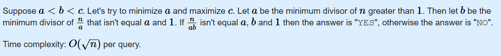

## Absolute Value

```
abs(x)
```

## Different parity

means one is odd the other is even

## Typecasting

(int)n[0] → ASCII of '5' is 53, not 5.

(n[0] - '0') → Proper integer conversion from char to its numeric digit.

## To convert string to int

```
string y;
int x=stoi(y);
```

## To convert string to ll

```
string y;
int x=stoll(y);
```

## Check if prime

```
bool is_prime(int x) {
    if (x <= 1) {
        return false;
    }
    for (int i = 2; i * i <= x; i++) {
        if (x % i == 0) {
            return false;
        }
    }
    return true;
}
```

## MEX

Smallest non-negative integer that is not present in the array

## Double

```
// bhai I usually use this way to compute such values but it gave precision error so replaced this with...
// int req = ceil(gap[i] / double(x));

// this
int req = (gap[i] + x - 1) / x;
```


## A question wherein I was to represent the number as the product of three distinct numbers and greater than 1
