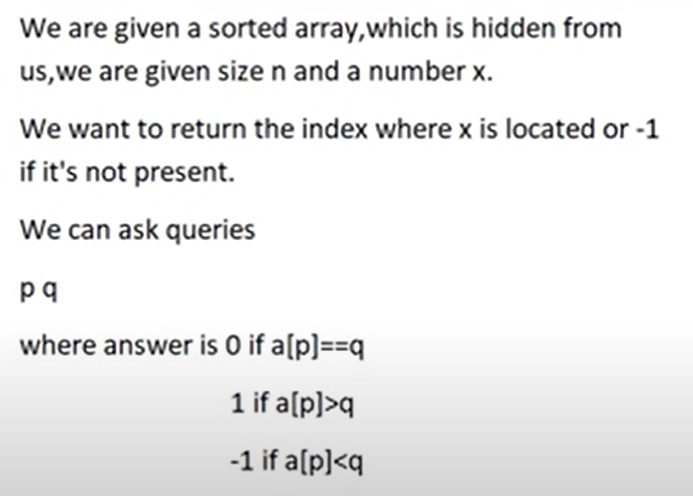

## Interactive Problems



```
#include <stdio.h>

int main() {
    int n, x;
    scanf("%d %d", &n, &x);

    int l = 0, r = n - 1;
    int ans = -1;

    while (l <= r) {
        int mid = (l + r) / 2;

        // Query
        printf("%d %d\n", mid, x);
        fflush(stdout);  // Important in interactive problems

        int response;
        scanf("%d", &response);

        if (response == 0) {
            ans = mid;
            break;
        } else if (response == 1) {
            r = mid - 1;
        } else {
            l = mid + 1;
        }
    }

    // Output the answer
    printf("%d\n", ans);
    fflush(stdout);
    return 0;
}

```
