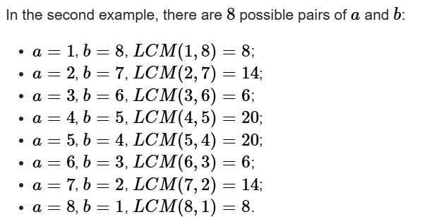

## Eucledian GCD (Greatest Commen Divisor)

### Implementation

```
// C++ program to demonstrate working of
#include <bits/stdc++.h>
using namespace std;

// Function to return
// gcd of a and b
int findGCD(int a, int b) {
    if (a == 0)
        return b;
    return findGCD(b % a, a);
}

int main()  {
    int a = 35, b = 15;
    int g = findGCD(a, b);
    cout << g << endl;
    return 0;
}
```

### In-built cpp

Library: 'algorithm'

```
__gcd(a, b)
```

Parameter : a, b
Return Value : 0 if both m and n are zero,
else gcd of a and b.

## Program to Find the gcd of all numbers in a vector.

```
#include<bits/stdc++.h>
using namespace std;

int main()
{
    vector<int> numbers = { 12, 15, 18, 21, 24 };
    int ans =__gcd(numbers[0], numbers[1]);
    for (int i = 2; i < numbers.size(); i++)
    {
        ans = __gcd(ans, numbers[i]);
    }
    cout << "The GCD of the numbers in the vector is: " <<ans<<endl;
    return 0;
}
```

## GCD and LCM

```
__gcd(a, b)
lcm = (a * b) / __gcd(a, b)

```

For example in one of the questions we were told to minimise the lcm of a and b such that a + b = n
So the optimal solution will focus on maximising the GCD and minimising a*b which in turn minimizes the lcm
Also for a*b to be less the difference btw a and b should be larger when a+b=n
a + b = n is fixed ⇒ so if one goes up, the other goes down, and a\*b is maximized when a = b = n/2 and decreases as they become more uneven.
if n==9
then



## Understanding divisors and prime factors

```
for (int i = 1; i*i <= n; i++) {
    if (n % i == 0) {
        // i and n/i are both divisors
    }
}
```

## Modular arithematic

## Euler's Theorem

## Sieve
